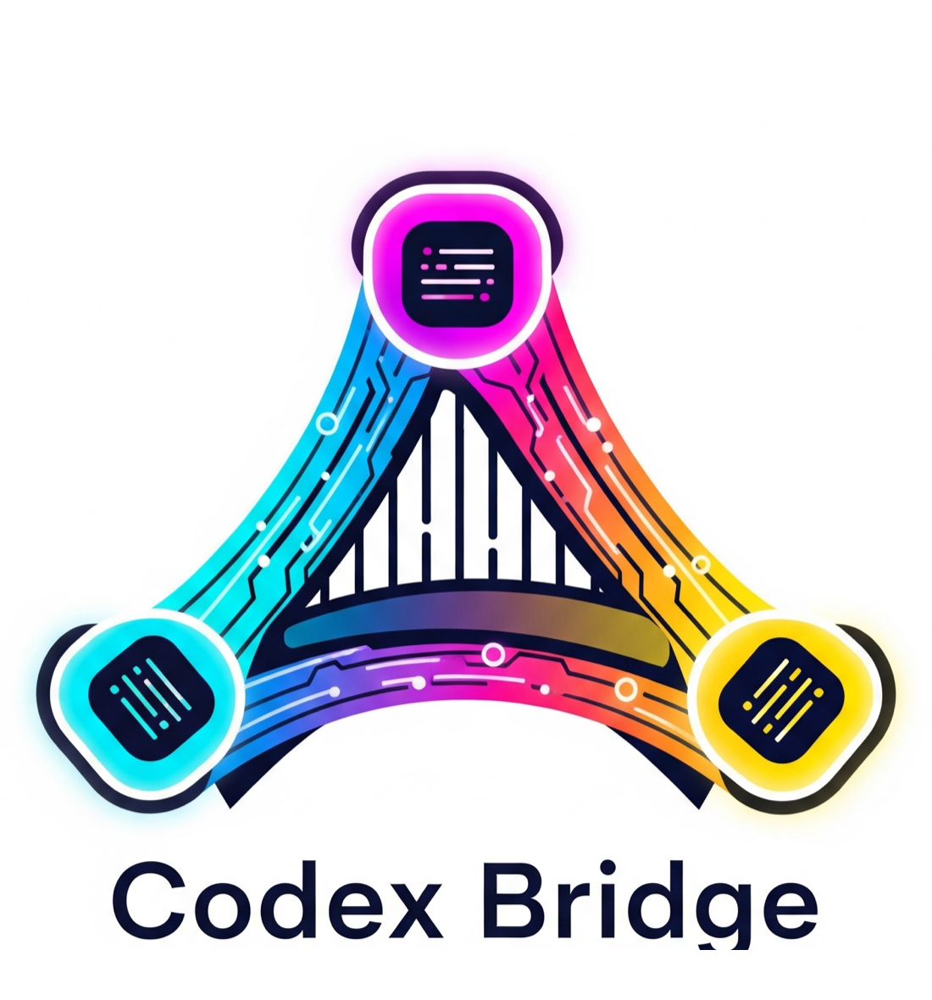

# Codex Bridge

<div align="center">
  
</div>


`codex-bridge` is an internal routing platform for mixed coding and operations workflows across a three-node setup. It keeps route selection heuristic-first, blocks risky work by default, preserves a strict typed execution boundary for Gemini automation, and stores observable run artifacts plus a SQLite run index on the router host.

`codex-bridge` là nền tảng internal routing cho workflow code và vận hành trên mô hình ba node. Hệ thống vẫn giữ heuristic-first routing, fail-closed safety, ranh giới thực thi typed command cho Gemini, cùng run artifacts và SQLite run index để truy vết lại toàn bộ quá trình.

## English Overview

### What It Does

- routes coding-heavy work to `codex`
- routes safe low-risk ops inspection to `gemini`
- blocks risky or destructive work to `human`
- handles simple local summarization/reporting under `local`

### Core Principles

- Heuristic-first routing, not mandatory LLM routing
- Fail-closed safety for risky or ambiguous work
- No Codex App UI automation
- No arbitrary shell execution from Gemini
- Observable runs with persisted artifacts and queryable run history

### Topology

| Node | Role | Typical responsibilities |
| --- | --- | --- |
| Mac mini `192.168.1.7` | operator workstation | Codex App, Gemini CLI, safe execution runner, SSH, Git |
| UbuntuDesktop `192.168.1.15` | router host | FastAPI router, prompts, profiles, SQLite run index, optional Ollama |
| UbuntuServer `192.168.1.30` | runtime node | services, logs, systemd, app runtime, PostgreSQL |

### Architecture Snapshot

- `dispatch` creates a `run_id`, persists request and response snapshots, and returns route-specific artifacts.
- Policy modules add `decision_trace` to classify, log, diff, and dispatch responses.
- Gemini automation uses typed `command_id + args`, validated against a strict allowlist.
- Execution results flow back to the router through an internal callback protected by `CODEX_BRIDGE_INTERNAL_API_TOKEN`.
- `/v1/runs`, `/v1/runs/{run_id}`, and `/v1/admin/metrics` expose the run index for observability.

### Quick Start

```bash
git clone git@github.com:tungpastry/codex-bridge.git
cd codex-bridge
python3 -m venv .venv
source .venv/bin/activate
pip install -r requirements.txt
cp .env.example .env
./scripts/run_dev.sh
curl -sS http://127.0.0.1:8787/health | jq .
```

### Main APIs

- `GET /health`
- `GET /health?depth=full`
- `POST /v1/classify/task`
- `POST /v1/summarize/log`
- `POST /v1/summarize/diff`
- `POST /v1/compress/context`
- `POST /v1/brief/codex`
- `POST /v1/report/daily`
- `POST /v1/dispatch/task`
- `GET /v1/runs`
- `GET /v1/runs/{run_id}`
- `GET /v1/runs/{run_id}/artifacts`
- `GET /v1/admin/metrics`

## Tổng Quan Tiếng Việt

### Hệ thống này dùng để làm gì?

- route việc code sang `codex`
- route các việc ops an toàn sang `gemini`
- chặn các việc rủi ro sang `human`
- xử lý các việc tóm tắt hoặc báo cáo đơn giản ở nhánh `local`

### Nguyên tắc cốt lõi

- ưu tiên heuristic trước model
- fail-closed khi có rủi ro
- không tự điều khiển UI của Codex App
- Gemini không được chạy shell tùy ý
- mọi run quan trọng đều có artifact và có thể query lại qua run index

### Khởi động nhanh

```bash
git clone git@github.com:tungpastry/codex-bridge.git
cd codex-bridge
python3 -m venv .venv
source .venv/bin/activate
pip install -r requirements.txt
cp .env.example .env
./scripts/run_dev.sh
curl -sS http://127.0.0.1:8787/health | jq .
```

### Những điểm mới quan trọng sau nâng cấp

- SQLite run index trên router
- `decision_trace` trong response heuristic
- typed execution model cho Gemini
- internal execution callback
- timing transparency cho Gemini headless
- docs tách rõ core docs và target-specific docs

## Documentation Map

### Core Docs in English

- [Architecture](docs/architecture.md)
- [API Reference](docs/api-reference.md)
- [Deployment](docs/deployment.md)
- [Workflow](docs/workflow.md)
- [Troubleshooting](docs/troubleshooting.md)
- [SOP](docs/sop.md)
- [Upgrade Blueprint v1](docs/upgrade-blueprint-v1.md)

### Tài Liệu Lõi Tiếng Việt

- [Kiến trúc](docs/architecture-vi.md)
- [API Reference tiếng Việt](docs/api-reference-vi.md)
- [Triển khai](docs/deployment-vi.md)
- [Luồng công việc](docs/workflow-vi.md)
- [Khắc phục sự cố](docs/troubleshooting-vi.md)
- [SOP tiếng Việt](docs/sop-vi.md)
- [Nâng cấp Blueprint v1](docs/upgrade-blueprint-v1-vi.md)

### Operator and Onboarding Guides

- [Hướng dẫn sử dụng cho người mới](docs/huong-dan-su-dung.md)
- [Tutorial: Coding task to Codex brief](docs/tutorials/coding-task.md)
- [Hướng dẫn: Từ task code tới Codex brief](docs/tutorials/coding-task-vi.md)
- [Tutorial: Ops incident with Gemini runner](docs/tutorials/ops-incident.md)
- [Hướng dẫn: Incident ops với Gemini runner](docs/tutorials/ops-incident-vi.md)

### Target Integrations

- [MiddayCommander integration](docs/targets/middaycommander.md)
- [Tích hợp MiddayCommander](docs/targets/middaycommander-vi.md)

### Brand Assets

- [Brand asset pack](docs/assets/brand/README.md)

## Key Runtime Paths

- Router service root on UbuntuDesktop: `/home/nexus/codex-bridge`
- Mac working copy: `/Users/macadmin/Documents/New project/codex-bridge`
- Prompts directory: `prompts/`
- Storage root: `storage/`
- Run index DB: `storage/index/runs.db`
- Profiles: `app/profiles/`

## Main Environment Variables

```env
APP_NAME=codex-bridge
PROMPTS_DIR=/home/nexus/codex-bridge/prompts
STORAGE_DIR=/home/nexus/codex-bridge/storage
RUN_INDEX_DB_PATH=/home/nexus/codex-bridge/storage/index/runs.db
PROFILES_DIR=/home/nexus/codex-bridge/app/profiles
CODEX_BRIDGE_BASE_URL=http://192.168.1.15:8787
CODEX_BRIDGE_INTERNAL_API_TOKEN=change-me-in-prod
```

## What This Repo Does Not Do

- no browser automation
- no AppleScript
- no Codex App UI control
- no arbitrary Gemini shell execution
- no queue system or general-purpose job orchestrator

## Related Notes

- `preferred_command_hosts` can guide Gemini to pick the right host for service-oriented commands.
- For the `codex-bridge` repo, the current profile prefers `UbuntuDesktop` for `systemctl` and `journalctl` commands.
- The safe command catalog remains intentionally small and typed.
- The README hero uses the light full-logo asset at `width="420"` to keep the header balanced on GitHub.

## License

[MIT](LICENSE)
