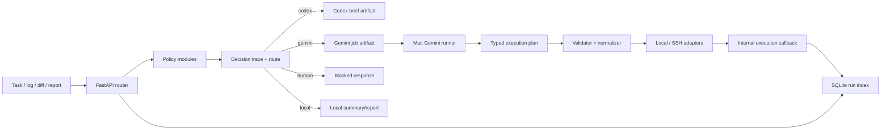

# Kiến Trúc

Tài liệu này mô tả kiến trúc hiện tại của `codex-bridge` sau khi phần nâng cấp production đã được triển khai.

Tài liệu liên quan:

- [README](../README.md)
- [API Reference](./api-reference-vi.md)
- [Triển khai](./deployment-vi.md)
- [Luồng công việc](./workflow-vi.md)
- [Khắc phục sự cố](./troubleshooting-vi.md)
- [English version](./architecture.md)

## Mục tiêu

`codex-bridge` là một internal routing platform gọn nhẹ cho workflow code và vận hành. Hệ thống không cố biến thành queue platform hay orchestration engine tổng quát. Kiến trúc hiện tại được tối ưu cho:

- heuristic-first routing
- fail-closed safety
- Codex App manual cho việc code
- Gemini automation chỉ đi qua safe command boundary có kiểu rõ ràng
- observability bằng filesystem artifacts và SQLite run index

## Topology Ba Node

| Node | Địa chỉ | Vai trò |
| --- | --- | --- |
| Mac mini | `192.168.1.7` | workstation, Codex App host, Gemini CLI runner |
| UbuntuDesktop | `192.168.1.15` | FastAPI router, prompts, profiles, SQLite run index owner |
| UbuntuServer | `192.168.1.30` | runtime node, services, logs, PostgreSQL |

## Luồng Hệ Thống

## Cấu Trúc Package

Kiến trúc mới được tách thành các package nhỏ, dễ review và dễ bảo trì:

- `app/api/routes`
- `app/core`
- `app/policy`
- `app/builders`
- `app/execution`
- `app/artifacts`
- `app/index`
- `app/profiles`
- `app/services`
- `app/schemas`

Các import cũ trong `app/routes/*` vẫn được giữ lại dưới dạng thin wrapper để tránh làm gãy flow hiện tại.

## Policy Layer

Logic routing heuristic hiện nằm trong:

- `task_policy.py`
- `log_policy.py`
- `diff_policy.py`
- `risk_policy.py`
- `route_engine.py`
- `decision_trace.py`

Mọi response classify, summarize, và dispatch đều có `decision_trace` với:

- `matched_rules[]`
- `confidence`

Mỗi matched rule ghi lại:

- `rule_name`
- `rule_type`
- `matched_value`
- `effect`
- note nếu có

Nhờ vậy route selection có thể giải thích được thay vì là hộp đen.

## Dispatch Lifecycle

`POST /v1/dispatch/task` là entrypoint orchestration chính. Trình tự hiện tại:

1. tạo `run_id`
2. persist run row ban đầu
3. lưu request snapshot
4. chạy policy và chọn route
5. persist matched rules vào `run_rules`
6. tạo artifact phù hợp với route
7. lưu response snapshot
8. cập nhật status của run

Các status hiện dùng:

- `created`
- `completed`
- `blocked`
- `awaiting_execution`
- `failed`
- `timeout`
- `interrupted`

## Run Index

Run index hiện dùng SQLite trên router host. Nó lưu:

- `runs`
- `run_commands`
- `run_rules`
- `artifacts`

Migrations nằm trong `app/index/migrations/` và tự chạy khi startup. Startup log bắt buộc phải có:

- `db_path`
- `current_user_version`
- `applied_migrations`
- `final_user_version`

Artifact trên filesystem trong `storage/` vẫn là audit trail đầy đủ. SQLite chỉ là lớp index và query.

## Artifact Taxonomy

Taxonomy hiện tại của artifact là:

- `request_snapshot`
- `response_snapshot`
- `codex_brief`
- `daily_report`
- `gemini_job`
- `execution_plan`
- `execution_result`
- `timing`
- `final_result`

Các artifact này vừa được lưu trên disk, vừa được index trong SQLite.

## Execution Model

Gemini không được chạy shell text tùy ý. Thay vào đó, nó chỉ được trả plan typed với:

- `host`
- `command_id`
- `args`
- `reason`

Execution đi qua:

- `validator.py`
- `result_normalizer.py`
- `redaction.py`
- `adapters/local.py`
- `adapters/ssh.py`

Allowed hosts hiện tại:

- `local`
- `UbuntuDesktop`
- `UbuntuServer`

Command catalog v1 hiện gồm:

- `router_health`
- `http_health`
- `journalctl_service`
- `systemctl_status`
- `systemctl_is_active`
- `systemctl_is_failed`
- `service_restart`
- `disk_usage`
- `memory_usage`
- `uptime`
- `process_list`
- `port_listen`
- `git_status`
- `git_diff_main_head`
- `git_log_recent`

## Safety Boundary

Ranh giới an toàn vẫn được giữ chặt:

- không có arbitrary shell từ Gemini
- không có `sudo` trong Gemini plan
- không có lệnh destructive
- không tự động đụng vào firewall, auth, secret rotation
- restart chỉ cho service nằm trong allowlist
- việc mơ hồ hoặc rủi ro phải route sang `human`

## Internal Callback

Sau khi Mac runner hoàn tất hoặc bị block, nó cập nhật router qua:

- `POST /v1/internal/runs/{run_id}/execution`

Callback này yêu cầu:

- `X-Codex-Bridge-Token`
- payload typed
- `phase`

Thiết kế callback là idempotent để retry không làm nhân đôi `run_commands` hay artifact index entries.

## Profiles

Profiles YAML được giữ ở mức tối giản. Chúng có thể định nghĩa:

- `repo_name`
- `default_safe_services`
- `common_repo_paths`
- `common_likely_files`
- `preferred_command_hosts`
- `prompt_hints`

Profiles chỉ là hint, không được làm yếu fail-closed safety.

Với profile `codex-bridge`, các service-oriented commands hiện ưu tiên `UbuntuDesktop`.

## Observability Và Timing

Gemini automation hiện persist một họ artifact thống nhất:

- `<run_id>-job.json`
- `<run_id>-gemini-output.json`
- `<run_id>-plan.json`
- `<run_id>-exec-results.json`
- `<run_id>-timing.json`
- `<run_id>-final.json`

Timing fields giúp tách rõ:

- `gemini_cli_duration_ms`
- `exec_duration_ms`
- `total_duration_ms`

Nhờ đó có thể biết độ trễ nằm ở model headless, execution, hay callback/update.

## Vì Sao Codex App Vẫn Giữ Manual

Kiến trúc này cố tình giữ Codex App ở chế độ manual cho các task code. `codex-bridge` chỉ chuẩn bị brief có cấu trúc, chứ không:

- điều khiển UI của Codex App
- tự động hóa browser
- dùng AppleScript
- giả định code change là safe chỉ vì routing đã thành công

Ranh giới này giúp workflow code vẫn reviewable trong khi workflow ops trở nên nhanh và an toàn hơn.
