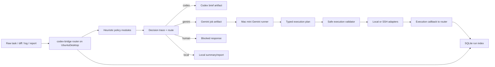

# Architecture

## Tong quan

`codex-bridge` la mot internal routing platform nho gon cho workflow DevOps + coding. Sau ban nang cap Production Blueprint v1, he thong van giu nguyen triet ly ban dau:

- routing uu tien heuristic
- fail-closed safety
- khong control UI cua Codex App
- Gemini chi duoc di qua structured safe command boundary
- moi run co artifact va co index de query lai

No khong co y bien thanh queue system, job orchestrator tong quat, hay full automation engine.

## Topology 3 node

| Node | Dia chi | Vai tro |
| --- | --- | --- |
| Mac mini | `192.168.1.7` | workstation, Codex App host, Gemini CLI runner |
| UbuntuDesktop | `192.168.1.15` | FastAPI router, prompt store, run index owner |
| UbuntuServer | `192.168.1.30` | runtime node, postgres, systemd services, logs |

## Luong chinh

## Package structure sau nang cap

He thong duoc tach thanh cac package nho, cohesive, de review va maintain de hon:

- `app/api/routes`
- `app/core`
- `app/policy`
- `app/builders`
- `app/execution`
- `app/artifacts`
- `app/index`
- `app/profiles`
- `app/services`
- `app/schemas`

Import cu duoc giu qua thin wrappers trong `app/routes/*` de tranh lam gay flow hien tai.

## Policy layer

Decision logic da duoc tach ra khoi service wrappers:

- `task_policy.py`
- `log_policy.py`
- `diff_policy.py`
- `risk_policy.py`
- `route_engine.py`
- `decision_trace.py`

Moi response classify/log/diff/dispatch deu co `decision_trace` gom:

- `matched_rules[]`
- `confidence`

Dieu nay giup operator biet vi sao he thong route sang `codex`, `gemini`, `human`, hoac `local`.

## Run index layer

SQLite run index la nguon query chinh cho observability tren router host.

Bang du lieu:

- `runs`
- `run_commands`
- `run_rules`
- `artifacts`

Migrations:

- `001_init.sql`
- `002_indexes.sql`

Startup se tu apply migration va ghi log migration bat buoc:

- `db_path`
- `current_user_version`
- `applied_migrations`
- `final_user_version`

Chi tiet artifact van nam o `storage/`; SQLite la lop index va query, khong thay the audit trail tren filesystem.

## Dispatch lifecycle

`/v1/dispatch/task` hien nay:

1. tao `run_id`
2. persist `request_snapshot`
3. chay policy va route
4. persist `run_rules`
5. tao artifact phu hop
6. persist `response_snapshot`
7. cap nhat status cua run

Run status hien tai:

- `created`
- `completed`
- `blocked`
- `awaiting_execution`
- `failed`
- `timeout`
- `interrupted`

## Execution model

Gemini khong duoc tra shell text tu do. No chi duoc tra plan co typed commands:

- `host`
- `command_id`
- `args`
- `reason`

Execution core duoc tach thanh:

- `validator.py`
- `result_normalizer.py`
- `redaction.py`
- `adapters/local.py`
- `adapters/ssh.py`

Mac runner van duoc giu lai:

- `scripts/mac/codex-bridge-run-gemini.sh`
- `scripts/mac/codex-bridge-exec-safe.sh`

nhung phan validate/normalize da day xuong Python core.

## Safety boundary

Allowed hosts:

- `local`
- `UbuntuDesktop`
- `UbuntuServer`

Allowed command IDs v1:

- `router_health`
- `http_health`
- `journalctl_service`
- `systemctl_status`
- `systemctl_is_active`
- `systemctl_is_failed`
- `service_restart`
- `disk_usage`
- `memory_usage`
- `uptime`
- `process_list`
- `port_listen`
- `git_status`
- `git_diff_main_head`
- `git_log_recent`

Fail-closed rules van giu nguyen:

- khong arbitrary shell tu Gemini
- khong `sudo`
- khong destructive shell
- restart chi cho service trong allowlist
- risky production/auth/firewall/secret flow van route `human`

## Execution callback

Mac runner cap nhat ket qua ve router qua:

- `POST /v1/internal/runs/{run_id}/execution`

Callback:

- bat buoc co token
- bat buoc co `phase`
- idempotent theo `run_id + phase`
- khong duoc nhan doi `run_commands`

`run_commands` duoc upsert theo identity `(run_id, ordinal)`.

## Profiles

Profiles YAML duoc giu toi gian, chi de lam hint:

- `repo_name`
- `default_safe_services`
- `common_repo_paths`
- `common_likely_files`
- `prompt_hints`

Profiles khong duoc phep lam yeu fail-closed safety.

Hai profile mau ban dau:

- `codex-bridge.yaml`
- `middaycommander.yaml`

## Timing va observability

Gemini run tren Mac mini duoc ghi timing ro rang:

- `gemini_cli_duration_ms`
- `exec_duration_ms`
- `total_duration_ms`

Artifact family dung chung mot `run_id`:

- `<run_id>-job.json`
- `<run_id>-gemini-output.json`
- `<run_id>-plan.json`
- `<run_id>-exec-results.json`
- `<run_id>-timing.json`
- `<run_id>-final.json`

Dieu nay giup phan biet do tre nam o:

- model headless
- safe command execution
- timeout/interrupted
- hay parse/validation failure

## Tai sao van giu Codex App manual

Ban nang cap nay khong doi huong san pham:

- khong UI automation
- khong AppleScript
- khong browser automation
- khong direct control Codex App

`codex-bridge` chi sinh brief de operator paste vao Codex App.
