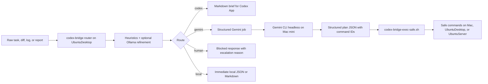

# Architecture

## Overview

`codex-bridge` is a lightweight routing layer between raw operator input and the tool that should actually handle the work. It does not try to become a job queue, a workflow engine, or a Codex App controller. The architecture is deliberately narrow:

- preprocess raw input
- classify risk and intent
- choose the correct route
- generate a safe artifact for that route
- record enough output to make operations understandable later

## Three-Node Topology

| Node | Address | Role |
| --- | --- | --- |
| Mac mini | `192.168.1.7` | operator workstation, Codex App host, Gemini CLI runner |
| UbuntuDesktop | `192.168.1.15` | FastAPI router, local LLM worker, prompt store |
| UbuntuServer | `192.168.1.30` | application runtime, PostgreSQL, cron, systemd, logs |

Responsibilities by node:

- Mac mini owns interactive coding and automated Gemini CLI headless runs.
- UbuntuDesktop owns classification, prompt loading, report generation, and route orchestration.
- UbuntuServer owns the services and logs that usually need inspection during incident response.

## Data Flow

## Why Preprocess Before Codex or Gemini

Without a router, every task arrives as a noisy blob. `codex-bridge` exists to make that blob usable:

- raw context is normalized before it is pasted into Codex App
- risky signals are detected before Gemini sees them as possible automation candidates
- logs and diffs are summarized into short, operator-friendly JSON
- the system can distinguish between “needs code changes” and “needs safe shell inspection”

This is especially important because Codex App does not automatically use the local model node. If local-model preprocessing happens, it happens because this custom router exists.

## Coding Path

The coding path is intentionally manual:

1. collect issue context, diff, or bug summary
2. call `/v1/brief/codex` or `/v1/dispatch/task`
3. receive `codex_brief_markdown`
4. paste the brief into Codex App
5. implement and review manually in the editor or Codex App

Why this remains manual:

- no UI automation
- no AppleScript
- no browser automation
- no hidden control of Codex App

## Gemini Automation Path

The Gemini path is automated, but only inside a strict safety boundary:

1. router builds a `gemini_job`
2. Mac mini runs `codex-bridge-run-gemini.sh`
3. Gemini CLI headless returns JSON, not free-form shell
4. the JSON contains `commands[]` with `host`, `command_id`, `args`, and `reason`
5. `codex-bridge-exec-safe.sh` validates every command against the whitelist
6. approved commands run locally or over SSH
7. invalid or risky plans fail closed

The command catalog is intentionally small in v1. It supports safe inspection and limited restarts for allowlisted services.

## Command Safety Model

Allowed hosts:

- `local`
- `UbuntuDesktop`
- `UbuntuServer`

Example allowed command IDs:

- `journalctl_service`
- `systemctl_status`
- `systemctl_is_active`
- `systemctl_is_failed`
- `service_restart`
- `disk_usage`
- `memory_usage`
- `uptime`
- `process_list`
- `port_listen`
- `git_status`
- `git_diff_main_head`
- `git_log_recent`

Blocked patterns include:

- destructive shell tokens
- arbitrary `sudo`
- `git push`
- `git reset`
- `docker`
- `kubectl`
- `psql`
- production auth, firewall, or secret rotation requests

## Timing Transparency

Gemini runs are now observable instead of opaque. The Mac runner records:

- `run_id`
- `job_id`
- raw Gemini output
- extracted plan JSON
- execution results
- timing metadata
- final merged output

Each run uses a single stable artifact family:

- `<run_id>-job.json`
- `<run_id>-gemini-output.json`
- `<run_id>-plan.json`
- `<run_id>-exec-results.json`
- `<run_id>-timing.json`
- `<run_id>-final.json`

This makes it easier to answer:

- did Gemini itself take too long
- was the delay in safe command execution
- did the run die before producing a valid plan
- did a timeout or `TERM` happen during headless execution

## Why V1 Avoids YOLO Tool Autonomy

V1 intentionally does not allow Gemini to execute arbitrary shell text directly.

Reasons:

- approval prompts can stall unattended workflows
- free-form shell is harder to validate deterministically
- command IDs are easier to audit than unbounded shell strings
- fail-closed behavior is more realistic for production operations
- structured output is easier to test than prompt-driven shell improvisation
