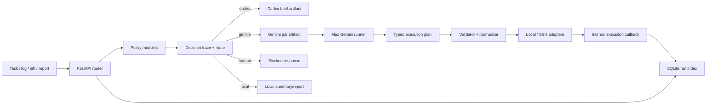

# Architecture

This document describes the current `codex-bridge` architecture after the production upgrade foundations landed.

Related docs:

- [README](../README.md)
- [API Reference](./api-reference.md)
- [Deployment](./deployment.md)
- [Workflow](./workflow.md)
- [Troubleshooting](./troubleshooting.md)
- [Vietnamese version](./architecture-vi.md)

## Purpose

`codex-bridge` is a small internal routing platform for mixed coding and operations work. It is intentionally not a general-purpose queue system or autonomous agent platform. The current architecture is optimized for:

- deterministic heuristic-first routing
- fail-closed risk handling
- manual Codex App usage for implementation-heavy tasks
- structured Gemini automation for safe command execution
- observable runs with filesystem artifacts and a SQLite run index

## Three-Node Topology

| Node | Address | Role |
| --- | --- | --- |
| Mac mini | `192.168.1.7` | operator workstation, Codex App host, Gemini CLI runner |
| UbuntuDesktop | `192.168.1.15` | FastAPI router, prompts, profiles, SQLite run index owner |
| UbuntuServer | `192.168.1.30` | runtime node, services, logs, PostgreSQL, deployment targets |

## System Flow

## Package Structure

The upgraded architecture is organized into small, cohesive packages:

- `app/api/routes` for canonical FastAPI route modules
- `app/core` for settings and runtime bootstrap
- `app/policy` for task, log, diff, and risk routing logic
- `app/builders` for Codex brief, Gemini job, report, and compression builders
- `app/execution` for typed execution validation, normalization, adapters, and callback client
- `app/artifacts` for artifact typing and registration helpers
- `app/index` for SQLite migrations and repository queries
- `app/profiles` for YAML profile loading
- `app/services` for orchestration services and compatibility wrappers
- `app/schemas` for request and response models

Legacy imports under `app/routes/*` still exist as thin wrappers so older entrypoints do not break.

## Policy Layer

Routing logic is split across:

- `task_policy.py`
- `log_policy.py`
- `diff_policy.py`
- `risk_policy.py`
- `route_engine.py`
- `decision_trace.py`

Every classify, summarize, and dispatch response includes a `decision_trace` object with:

- `matched_rules[]`
- `confidence`

Each matched rule captures:

- `rule_name`
- `rule_type`
- `matched_value`
- `effect`
- optional note text

This makes route selection explainable instead of opaque.

## Dispatch Lifecycle

`POST /v1/dispatch/task` is the main orchestration entrypoint. Its lifecycle is:

1. generate `run_id`
2. persist a run row with initial metadata
3. save the dispatch request snapshot
4. execute policy and route selection
5. persist matched rules into `run_rules`
6. generate route-specific artifacts such as `codex_brief` or `gemini_job`
7. save the dispatch response snapshot
8. update the run status

Current status values include:

- `created`
- `completed`
- `blocked`
- `awaiting_execution`
- `failed`
- `timeout`
- `interrupted`

## Run Index

The run index is a lightweight SQLite database on the router host. It tracks:

- `runs`
- `run_commands`
- `run_rules`
- `artifacts`

Migrations live under `app/index/migrations/` and are auto-applied on startup. Startup logs must report:

- `db_path`
- `current_user_version`
- `applied_migrations`
- `final_user_version`

Filesystem artifacts under `storage/` remain the canonical audit trail. SQLite acts as the query and observability layer, not a replacement for saved files.

## Artifact Taxonomy

The current v1 artifact taxonomy is:

- `request_snapshot`
- `response_snapshot`
- `codex_brief`
- `daily_report`
- `gemini_job`
- `execution_plan`
- `execution_result`
- `timing`
- `final_result`

These artifact types are indexed in SQLite and also persisted on disk.

## Execution Model

Gemini never receives permission to execute arbitrary shell text. Instead, it returns a typed execution plan built from:

- `host`
- `command_id`
- `args`
- `reason`

Execution then flows through:

- `validator.py`
- `result_normalizer.py`
- `redaction.py`
- `adapters/local.py`
- `adapters/ssh.py`

Current allowed hosts:

- `local`
- `UbuntuDesktop`
- `UbuntuServer`

Current command catalog includes:

- `router_health`
- `http_health`
- `journalctl_service`
- `systemctl_status`
- `systemctl_is_active`
- `systemctl_is_failed`
- `service_restart`
- `disk_usage`
- `memory_usage`
- `uptime`
- `process_list`
- `port_listen`
- `git_status`
- `git_diff_main_head`
- `git_log_recent`

## Safety Boundary

The execution boundary stays strict:

- no arbitrary shell emitted by Gemini
- no `sudo` through Gemini plans
- no destructive commands
- no firewall, auth, or secret rotation through Gemini
- restart is allowed only for services in the configured allowlist
- ambiguous or risky work must route to `human`

## Internal Callback

When the Mac runner finishes or blocks, it updates the router via:

- `POST /v1/internal/runs/{run_id}/execution`

The callback requires:

- `X-Codex-Bridge-Token`
- a typed payload
- a `phase`

It is designed to be idempotent so retries do not duplicate command rows or artifact index entries.

## Profiles

Profiles are intentionally small YAML hints. They can define:

- `repo_name`
- `default_safe_services`
- `common_repo_paths`
- `common_likely_files`
- `preferred_command_hosts`
- `prompt_hints`

Profiles can help route context and host preference, but they are not allowed to weaken fail-closed safety.

For the `codex-bridge` profile, service-oriented commands currently prefer `UbuntuDesktop`.

## Observability and Timing

Gemini automation persists a consistent run artifact family:

- `<run_id>-job.json`
- `<run_id>-gemini-output.json`
- `<run_id>-plan.json`
- `<run_id>-exec-results.json`
- `<run_id>-timing.json`
- `<run_id>-final.json`

Timing fields distinguish model latency from execution latency:

- `gemini_cli_duration_ms`
- `exec_duration_ms`
- `total_duration_ms`

This makes it possible to diagnose whether slow runs are caused by the model, command execution, or callback/update behavior.

## Why Codex App Stays Manual

The architecture deliberately keeps Codex App manual for implementation-heavy tasks. `codex-bridge` prepares structured briefs, but does not:

- control the Codex App UI
- automate browser actions
- use AppleScript
- pretend code changes are safe to auto-apply just because routing succeeded

That boundary keeps coding work reviewable while still making ops automation faster and safer.
